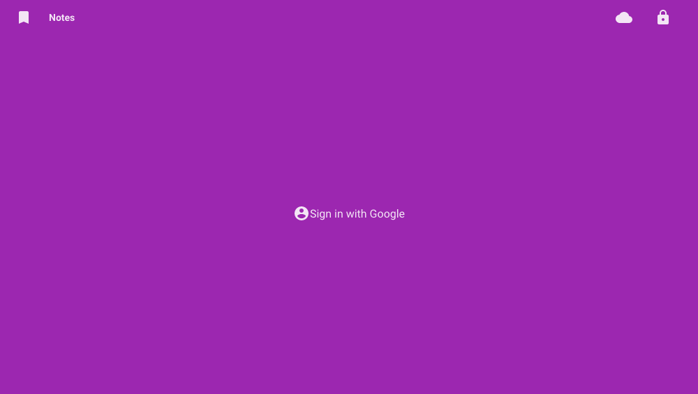
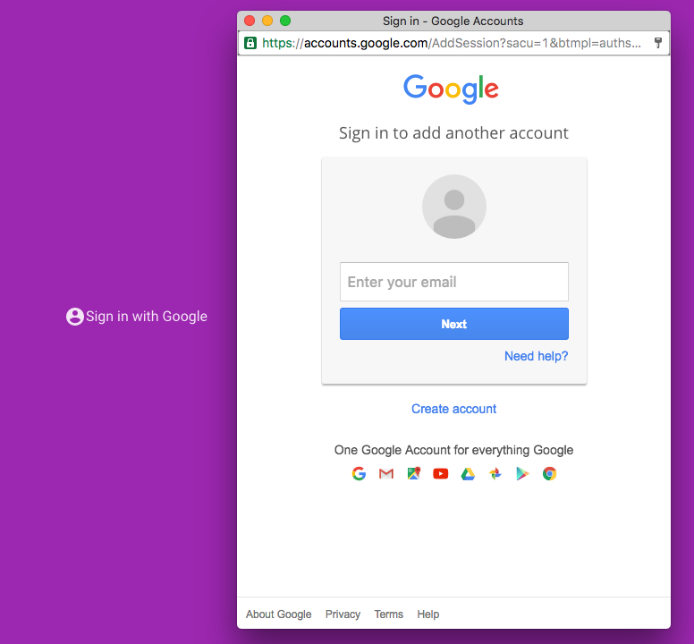
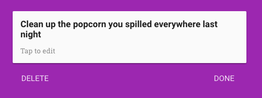
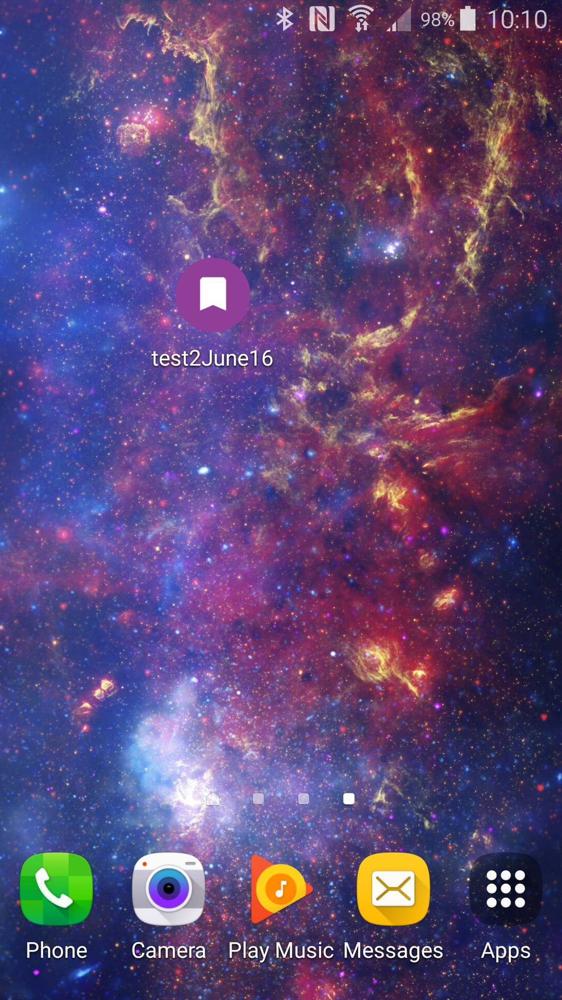
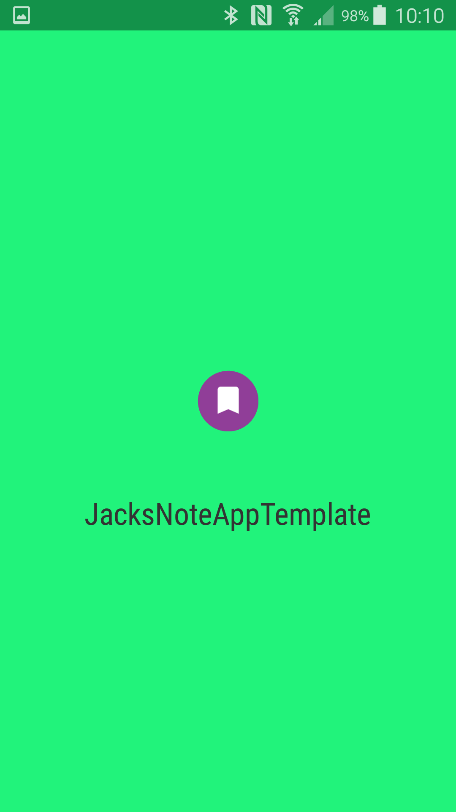
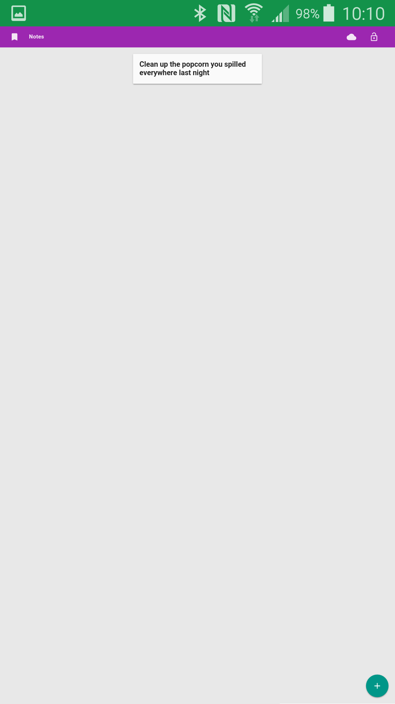

# PolymerFirebase_BasicNodeApp

# View this project live
[My project](https://< your project name >.firebaseapp.com/)
* Live as of 2June16

## Information
* Created from a [web tutorial](https://codelabs.developers.google.com/codelabs/polymer-firebase-pwa/index.html?index=..%2F..%2Fio2016#0)

## Content
### Sign in with google/account creation

### Create Notes

### allows "on the line" or "off the line" support

### Looks like a native app on android

*note* that the previously created note syncs

## Motivation
* Use *up to date* elements
* Gain polymer experience
* Gain firebase experience

## keywords
Progressive web application, Google, polymer, "there's an element for that", firebase

## Notes
* Modifications needed to work
  * index.html
    * api-key="< your API-key >"
    * auth-domain="< your auth-domain >"
    * database-url="< your database-url >"
  * .firebaserc
    * "default": "< your project name >"
